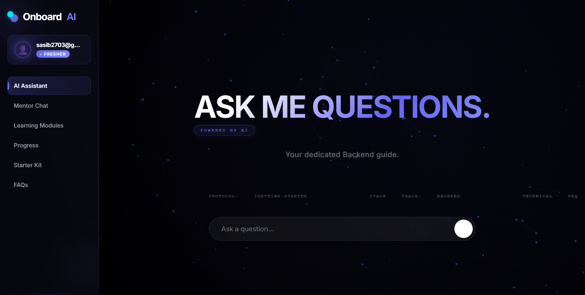

  

---

## 📌 Overview

Onboard Hub is a smart onboarding platform built to help new employees ramp up faster.

Instead of fragmented documents, repeated mentor calls, and slow onboarding cycles, Onboard Hub creates a centralized experience powered by AI and structured learning.

---

## 🎯 Problem

Traditional onboarding is broken.

* Information is scattered across documents and chats
* Mentors repeatedly answer the same questions
* New hires struggle with direction and clarity
* Learning progress is difficult to track

This creates friction, slows productivity, and weakens onboarding quality.

---

## 💡 Solution

Onboard Hub solves this through a hybrid AI + mentor approach.

The platform combines intelligent assistance with structured onboarding workflows to create a smoother learning experience.

---

## ⚡ Core Features

### 🤖 AI Assistant

Instantly answers onboarding queries using internal knowledge.

### 📚 Knowledge Base

Centralized documentation and learning resources.

### 🧠 Learning Modules

Structured onboarding paths for faster adaptation.

### 📈 Progress Tracking

Track learning milestones and onboarding completion.

### 👨‍🏫 Mentor Support

Escalate complex questions to human mentors.

---

## 🛠 Tech Stack

**Frontend**
HTML • CSS • JavaScript

**Backend**
Node.js • Express.js

**Database**
MongoDB

**AI Integration**
Gemini / Ollama

---

## 🚀 Project Vision

We believe onboarding should feel guided, intelligent, and frictionless.

Great teams are built through clarity, not confusion.

Onboard Hub aims to redefine how modern organizations welcome and train talent.

---
## 👥 Team

Built collaboratively by:

* **Sasidhar B**
* **Vinay Sathwik**
* **Jignesh**
